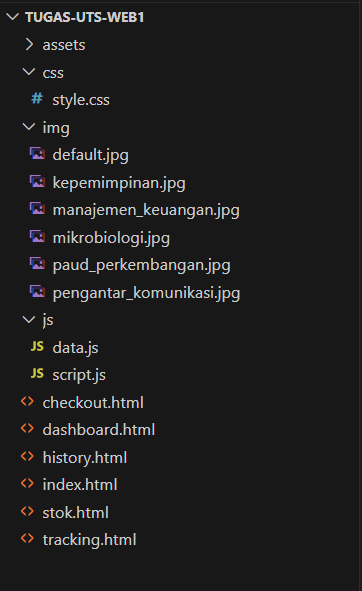
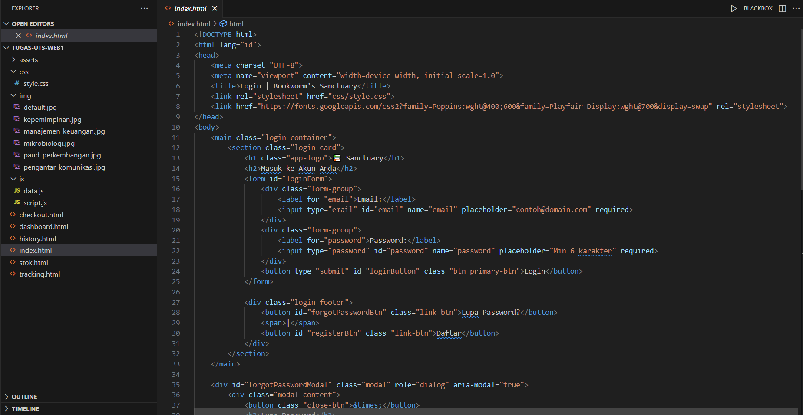
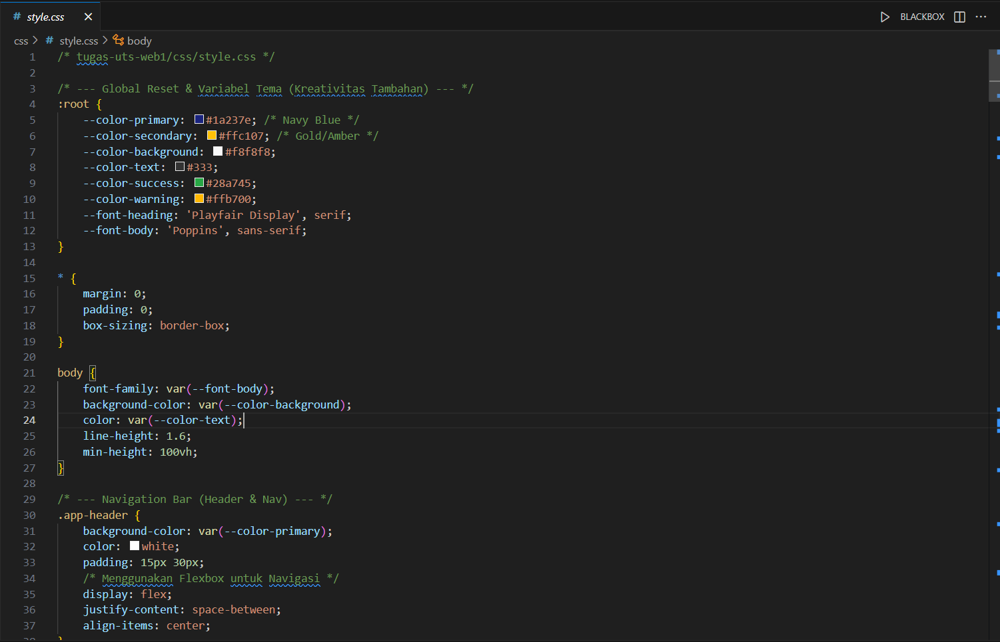
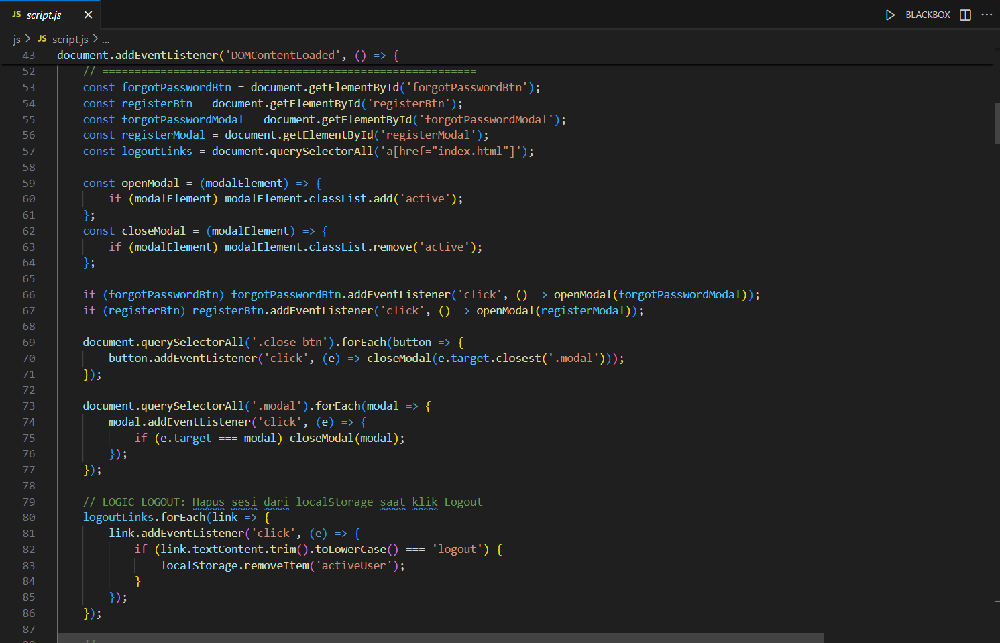

# Pemograman_web1_UTS
Nama: Den Fahmi Satria 

Nim: 312410523 

Kelas: TI.24.A5 

[Lihat file JavaScript](script.js)
# 📚 Aplikasi Web Pemesanan Buku Sederhana (Front-End Simulation)

Aplikasi web sederhana ini dibuat untuk memenuhi Ujian Tengah Semester (UTS) mata kuliah Pemrograman Web 1. Fokus utama proyek ini adalah demonstrasi penguasaan fundamental **HTML Semantik**, **CSS Styling**, dan **JavaScript DOM Manipulation** untuk menciptakan alur kerja aplikasi dinamis.

Proyek ini mensimulasikan proses pemesanan buku, mulai dari login hingga pencatatan riwayat transaksi. Seluruh data (pengguna, katalog, riwayat) dikelola di sisi klien menggunakan variabel Array JSON (`data.js`) tanpa menggunakan *backend* atau *database* server.

## Fitur Utama

Aplikasi ini mencakup lima halaman utama dengan fungsionalitas dinamis:

### 1. Halaman Login (`index.html`)
* **Simulasi Sesi:** Menggunakan `localStorage` untuk menyimpan data pengguna aktif (`activeUser`) setelah berhasil *login*.
* **Validasi:** Menerapkan validasi kredensial (Email & Password) terhadap data di `data.js`.
* **Interaksi UI:** Menampilkan **Modal Box/Pop-up** untuk simulasi fitur Lupa Password dan Daftar.

### 2. Dashboard (`dashboard.html`)
* **Greeting Dinamis (JavaScript DOM Manipulation):** Menampilkan sapaan yang disesuaikan berdasarkan waktu lokal (*Pagi/Siang/Sore/Malam*) dan menyertakan nama serta *role* pengguna aktif.

### 3. Pemesanan / Checkout (`checkout.html`)
* **Real-time Calculation:** Perhitungan total pembayaran yang otomatis diperbarui berdasarkan kuantitas pesanan.
* **Dynamic Data Management:** Logika pemesanan secara langsung:
    * Membuat Nomor Faktur unik baru.
    * **Mengurangi stok** buku dari `dataKatalogBuku`.
    * Menambahkan item baru ke `dataHistoryTransaksi`.
* **Tampilan Invoice:** Setelah konfirmasi, *form* pemesanan disembunyikan dan digantikan oleh tampilan **Invoice** transaksi yang baru dibuat di halaman yang sama.

### 4. History Transaksi (`history.html`)
* **Filter Berdasarkan Role (Kriteria Penting UTS):**
    * **User:** Hanya dapat melihat transaksi yang dilakukan oleh dirinya sendiri.
    * **Admin:** Dapat melihat seluruh riwayat transaksi yang tercatat.
* **Tautan Lacak:** Kolom aksi menyediakan tombol untuk melacak pengiriman jika pesanan sudah memiliki Nomor Delivery Order (`nomorDO`).

### 5. Tracking Pengiriman (`tracking.html`)
* Menerima input Nomor Delivery Order (DO) dan menampilkan status pengiriman, detail ekspedisi, dan riwayat perjalanan (simulasi *timeline*).

## ⚙️ Struktur Proyek (Modularitas)

Struktur file dan modularitas mengikuti panduan soal UTS: 

 

## 🛠️ Teknologi yang Digunakan

* **HTML5:** Struktur dasar dan semantik.
   

* **CSS3:** Styling dan *layouting* (Flexbox/Grid).
   

* **JavaScript (ES6):** Manipulasi DOM, validasi *form*, manajemen data Array JSON, dan `localStorage` untuk manajemen sesi.
 

## 📝 Penjelasan Video Presentasi

Video penjelasan proyek ini disajikan untuk memberikan alur berpikir dan demonstrasi fitur secara langsung. Poin-poin yang dibahas dalam video meliputi:

### 1.  Penjelasan modularitas file (`data.js` vs `script.js`).
### 2.  Demonstrasi fitur inti **Filter Riwayat Transaksi** berdasarkan **Role** (`Admin` vs `User`).
### 3.  Demonstrasi logika **Checkout** (penghitungan harga, pengurangan stok, dan tampilan *invoice* di halaman yang sama).
### 4.  Penggunaan `localStorage` untuk manajemen sesi.
### 5.  Validasi *form* dan *alert/modal box* sesuai kriteria UTS.
## berikut Link Youtube saya (https://youtu.be/nZBi3UCrGx4?si=QmRojA06vCCSHk-z)

